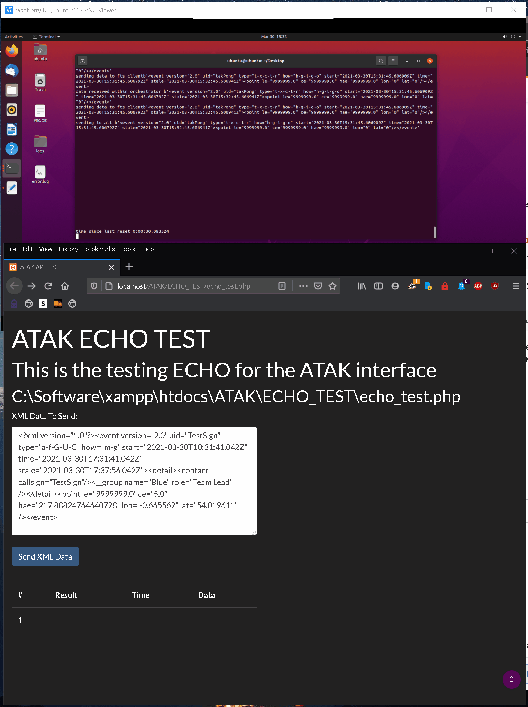
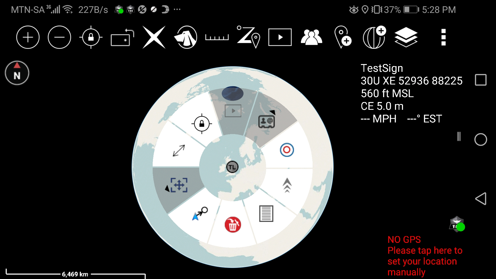

# FreeTAKServer XML Echo Tester

Web based quick and dirty (`HTML`, `PHP`, `JavaScript`) GUI to check `XML` files with the `FreeTAKServer`.

Example:

```XML
<event version="2.0" uid="TEST" type="a-f-G-U-C" how="m-g" start="2021-03-30T17:31:41.042Z" time="2021-03-30T17:31:41.042Z" stale="2021-03-30T17:37:56.042Z">
    <detail>
        <contact callsign="TestSign"/>
        <__group name="Blue" role="Team Lead" />
    </detail>
    <point le="9999999.0" ce="5.0" hae="217.88824764640728" lon="-0.665562" lat="54.019611" />
</event>
```

Server

[](img/server.gif)

EUD

[](img/eud.jpg)

# TODO

- Optimize code.
- Create database for results.
- Improve JavaScript and PHP (maybe add ajax response).

> XML online formatter https://www.webtoolkitonline.com/xml-formatter.html
