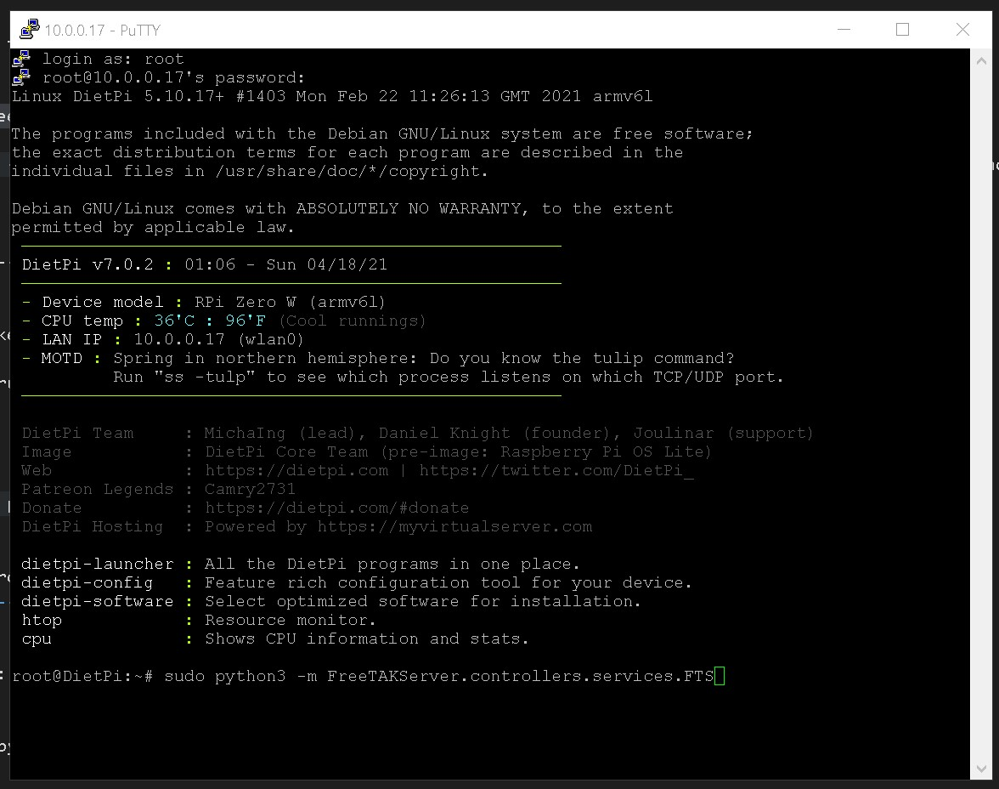
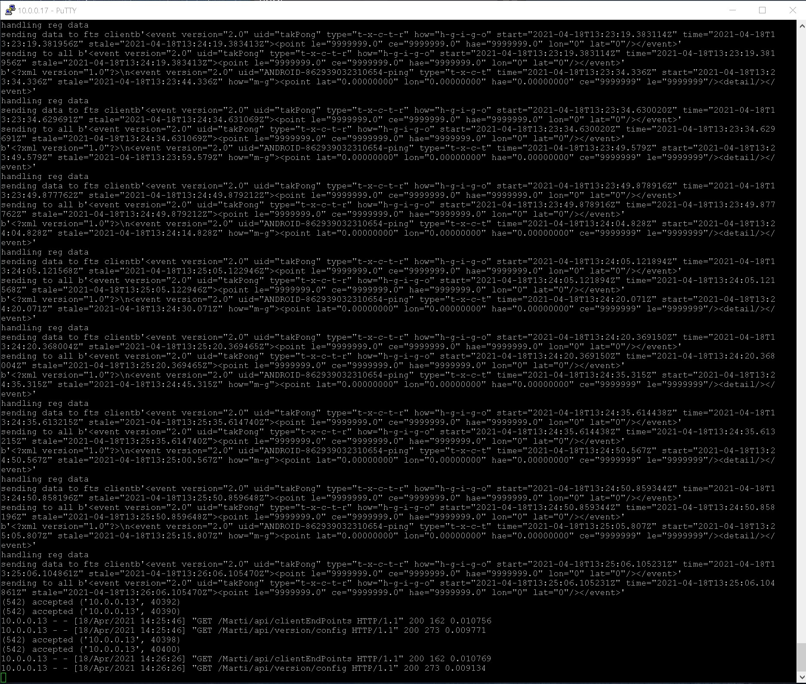
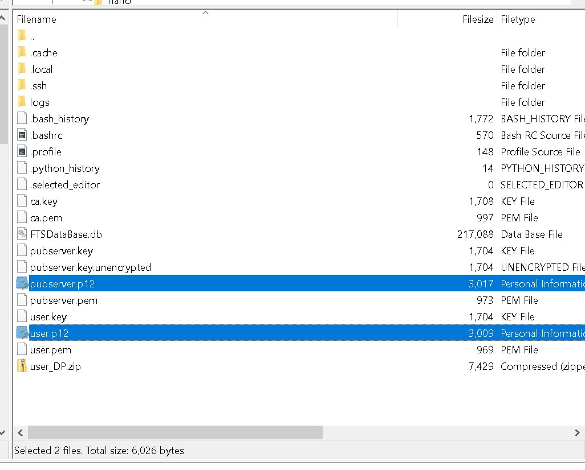
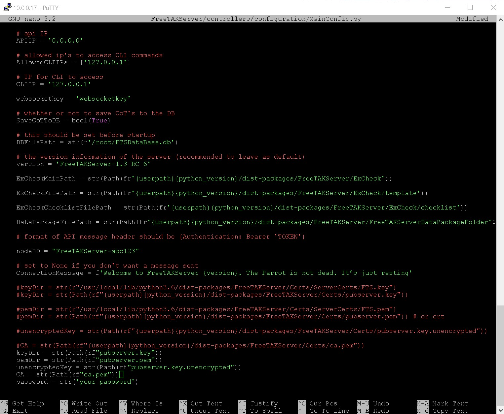

# FreeTAKServer Install On Raspberry Pi Zero W

TODO recommended before setup
- Install DietPi https://dietpi.com
- setup SSH, FTP & Python3 in DietPi check online for tutorials.
- setup static IP Wlan or eth(Wlan recommended) in DietPi check online for tutorials.

https://pypi.org/project/FreeTAKServer/


FTP DETAILS:

- H: `sftp://10.0.0.17`
- U: `root`
- P: `dietpi`

## More Info
FreeTAKServer documentation for end users

| Description                    | Link                                                                         |
|--------------------|------------------------------------------------------------------------------------------|
| User Docs:         | https://freetakteam.github.io/FreeTAKServer-User-Docs/                                   |
| PyPi Install Docs: | https://freetakteam.github.io/FreeTAKServer-User-Docs/Installation/PyPi/Linux/Install/   |
| Server Download:   | https://github.com/FreeTAKTeam/FreeTakServer                                             |
| Server Releases:   | https://github.com/FreeTAKTeam/FreeTakServer/releases                                    |

--------------------------------

1. update DietPi

```properties

root@DietPi:~# sudo apt update

```

--------------------------------

2. check python

```properties

root@DietPi:~# Python3

```

--------------------------------

3. Now browse to `/usr/local/lib/python3.7/dist-packages` in the terminal:

```properties

root@DietPi:~# cd /

root@DietPi:~# cd /usr/local/lib/python3.7/dist-packages

```

--------------------------------

4. Once in `/usr/local/lib/python3.7/dist-packages` run the command below:

```properties

root@DietPi:~# sudo python3 -m pip install FreeTAKServer==1.3.0.6

root@DietPi:~# sudo apt install python3-dev python3-setuptools build-essential python3-gevent python3-lxml libcairo2-dev

root@DietPi:~# sudo pip3 install wheel pycairo

root@DietPi:~# pip check FreeTakServer

```

--------------------------------

5. After the installation has finished open the `MainConfig.py` file for editing

```properties

root@DietPi:~# cd /usr/local/lib/python3.7/dist-packages

root@DietPi:~# sudo nano FreeTAKServer/controllers/configuration/MainConfig.py

```

--------------------------------

6. In order to run the server do:

```properties

root@DietPi:~# sudo python3 -m FreeTAKServer.controllers.services.FTS

OR

root@DietPi:~# nohup sudo python3 -m FreeTAKServer.controllers.services.FTS -DataPackageIP [YourIP] -AutoStart True nohup sudo python3 -m

```

[](img/1.jpg)

--------------------------------


7. If you would like to setup a cronjob (for server start on boot) use the commands below:

Set up cronjob to run FTS start commands on boot:

```properties

root@DietPi:~# crontab -e

root@DietPi:~# @reboot nohup sudo python3 -m FreeTAKServer.controllers.services.FTS &

```
systemctl status cron

--------------------------------


8. To uninstall do:

```properties

root@DietPi:~# cd /usr/local/lib/python3.7/dist-packages

root@DietPi:~# pip uninstall FreeTAKServer

root@DietPi:~# sudo  rm /root/FTSDataBase.db

```

--------------------------------

9. To check logs do:

```properties

root@DietPi:~# cd /usr/local/lib/python3.7/dist-packages/FreeTAKServer/controllers/logs

root@DietPi:~# sudo nano FTS_debug.log
root@DietPi:~# sudo nano FTS_http.log
root@DietPi:~# sudo nano FTS_info.log
root@DietPi:~# sudo nano FTS_warning.log

```

--------------------------------

You may receive an error like in the screenshot below:

[](img/2.jpg)

10. Creating Certificate files and Client Data Packages for FTS.


A tool has been created for this [here](https://github.com/lennisthemenace/ATAK-Certs). It is not needed from `FTS 1.5` up.

with reference to [this](https://github.com/FreeTAKTeam/FreeTakServer/issues/106) issue a fix was made.

Since we are using `FreeTAKServer==1.3.0.6` for the `Pi Zero W` we still needed to impliment this fix.

CHECK `pyopenssl` IS INSTALLED
```properties

root@DietPi:~# sudo python3 -m pip install pyopenssl

```

GET THE FILES
```properties

root@DietPi:~# curl -L https://git.io/JL9DP | sudo python3 - -a -c -i 10.0.0.17

```

Now login with Filezilla `sftp://10.0.0.17` and download the certs `user.p12` & `pubserver.p12` for the EUD's.

[](img/4.jpg)

If your files are in the root dir change the paths to:

```Python
    #keyDir = str(r"/usr/local/lib/python3.6/dist-packages/FreeTAKServer/Certs/ServerCerts/FTS.key")
    keyDir = str(Path(rf"pubserver.key"))

    #pemDir = str(r"/usr/local/lib/python3.6/dist-packages/FreeTAKServer/Certs/ServerCerts/FTS.pem")
    pemDir = str(Path(rf"pubserver.pem")) # or crt

    unencryptedKey = str(Path(rf"pubserver.key.unencrypted"))

    CA = str(Path(rf"ca.pem"))

    password = str('atakatak')
```

[](img/3.jpg)

`MainConfig.py` file contents:

```Python

import os
currentPath = os.path.dirname(os.path.abspath(__file__))
from pathlib import Path


class MainConfig:
    """
    this is the main configuration file and is the only one which
    should need to be changed
    """
    # this is the port to which clients will connect
    CoTServicePort = int(8087)

    SSLCoTServicePort = int(8089)

    # this needs to be changed for private data packages to work
    DataPackageServiceDefaultIP = str("0.0.0.0")

    python_version = 'python3.8'

    userpath = '/usr/local/lib/'

    # api port
    APIPort = 19023

    # api IP
    APIIP = '0.0.0.0'

    # allowed ip's to access CLI commands
    AllowedCLIIPs = ['127.0.0.1']

    # IP for CLI to access
    CLIIP = '127.0.0.1'

    websocketkey = 'websocketkey'

    # whether or not to save CoT's to the DB
    SaveCoTToDB = bool(True)

    # this should be set before startup
    DBFilePath = str(r'/root/FTSDataBase.db')

    # the version information of the server (recommended to leave as default)
    version = 'FreeTAKServer-1.3 RC 6'

    ExCheckMainPath = str(Path(fr'{userpath}{python_version}/dist-packages/FreeTAKServer/ExCheck'))

    ExCheckFilePath = str(Path(fr'{userpath}{python_version}/dist-packages/FreeTAKServer/ExCheck/template'))

    ExCheckChecklistFilePath = str(Path(fr'{userpath}{python_version}/dist-packages/FreeTAKServer/ExCheck/checklist'))

    DataPackageFilePath = str(Path(fr'{userpath}{python_version}/dist-packages/FreeTAKServer/FreeTAKServerDataPackageFolder'))

    # format of API message header should be {Authentication: Bearer 'TOKEN'}

    nodeID = "FreeTAKServer-abc123"

    # set to None if you don't want a message sent
    ConnectionMessage = f'Welcome to FreeTAKServer {version}. The Parrot is not dead. It’s just resting'

    #keyDir = str(r"/usr/local/lib/python3.6/dist-packages/FreeTAKServer/Certs/ServerCerts/FTS.key")
    keyDir = str(Path(rf"{userpath}{python_version}/dist-packages/FreeTAKServer/Certs/pubserver.key"))

    #pemDir = str(r"/usr/local/lib/python3.6/dist-packages/FreeTAKServer/Certs/ServerCerts/FTS.pem")
    pemDir = str(Path(rf"{userpath}{python_version}/dist-packages/FreeTAKServer/Certs/pubserver.pem")) # or crt

    unencryptedKey = str(Path(rf"{userpath}{python_version}/dist-packages/FreeTAKServer/Certs/pubserver.key.unencrypted"))

    CA = str(Path(rf"{userpath}{python_version}/dist-packages/FreeTAKServer/Certs/ca.pem"))

    password = str('your password')

```