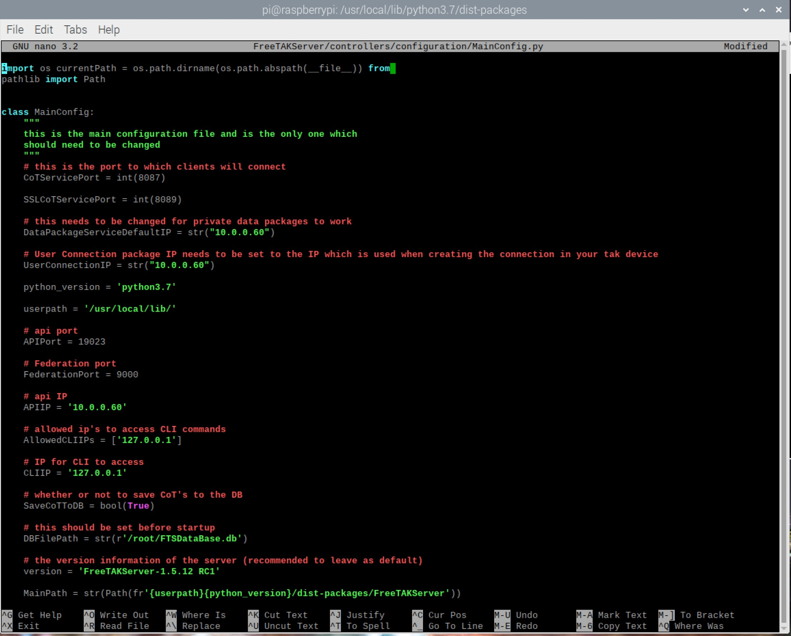
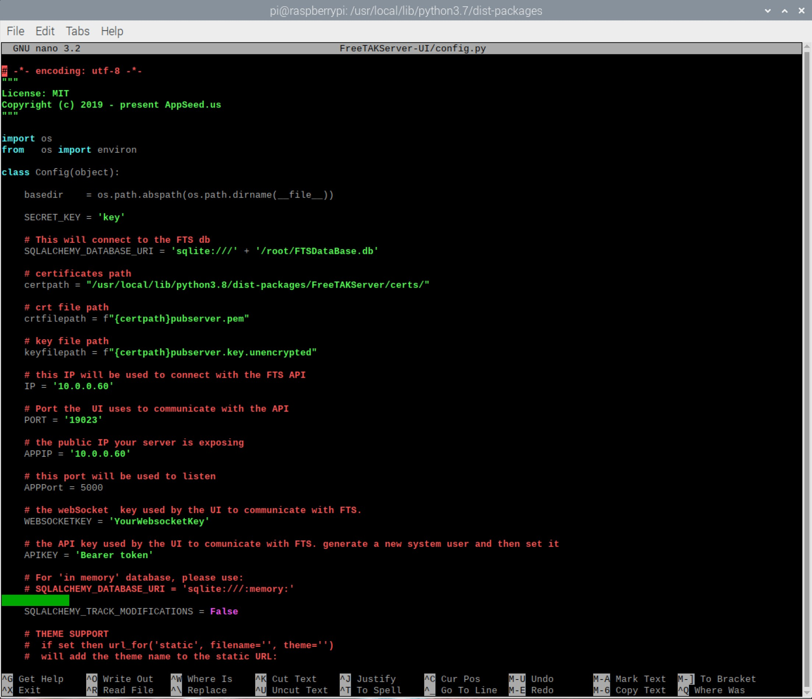

# FreeTAKServer Install On Raspberry Pi OS


Below is the installation commands and comments for the installation of FreeTAKServer on RPi 4 4GB modle:

## More Info
FreeTAKServer documentation for end users

| Description                    | Link                                                                         |
|--------------------|------------------------------------------------------------------------------------------|
| User Docs:         | https://freetakteam.github.io/FreeTAKServer-User-Docs/                                   |
| PyPi Install Docs: | https://freetakteam.github.io/FreeTAKServer-User-Docs/Installation/PyPi/Linux/Install/   |
| Server Download:   | https://github.com/FreeTAKTeam/FreeTakServer                                             |
| Server Releases:   | https://github.com/FreeTAKTeam/FreeTakServer/releases                                    |


## RPiFTS Series
GHOST_DA-B6 has created a set of videos on youtube detailing how to install and set up FTS on raspberry pi SBC's.

You can view his RPiFTS video series on his [channel](https://www.youtube.com/channel/UC--WpY--HV7PymMWLgfflZA).

## release version 1.5.10

FreeTAKServer provides Situational Awareness and other capabilities such as:

- sci-fi themed Web Administration
- SSL Encryption Management
- Health Monitor
- Dynamically change IP / ports, start, stop FTS services from web UI
- Service management
- Federation Service (Connecting two or more FTS or TAK server instances)
- Data Package upload and retrieval
- Private data package (user to user)
- Image transfer and storage
- COT recording in a database
- Execution of common task list (using the ExCheck plugin for WinTAK; ATAK plugin only available to users with takmaps.com access)
- User Management
- Command Line Interface
- REST API for creation of information such as emergency, Enemy units and so on

the preferred way to install FTS is by using Pip, that would solve all the required dependencies. the offline release requires additional manual work and has to be used only in the cases where internet connection is not available.

-----------

## Install Instructions

1. 

Install Python 3 on your RPI

```properties

pi@raspberrypi:~$ sudo apt update

pi@raspberrypi:~$ sudo apt install python3 idle3

```

2. 

Now browse to `/usr/local/lib/python3.7/dist-packages` in the terminal:

```properties

pi@raspberrypi:~$ cd /

pi@raspberrypi:~$ cd /usr/local/lib/python3.7/dist-packages

```

3. 

Once in `/usr/local/lib/python3.7/dist-packages` run the command below:

```properties

pi@raspberrypi:~$ sudo python3 -m pip install FreeTAKServer[ui]

```

4. 

After the installation has finished open the `MainConfig.py` file for editing

```properties

pi@raspberrypi:~$ sudo nano FreeTAKServer/controllers/configuration/MainConfig.py

```
Example picture below:

[](img/MainConfig.jpg)

5. 

When finished configuring `MainConfig.py` open the `config.py` file for editing

```properties

pi@raspberrypi:~$ sudo nano FreeTAKServer-UI/config.py

```
Example picture below:

[](img/Config.jpg)

6. 

In order to run the server and the GUI two terminal windows must be opened and the commands below must be run:

SERVER START COMMAND
```properties

pi@raspberrypi:~$ sudo python3 -m FreeTAKServer.controllers.services.FTS

```

UI START COMMAND
```properties

pi@raspberrypi:~$ sudo FLASK_APP=/usr/local/lib/python3.7/dist-packages/FreeTAKServer-UI/run.py python3 /usr/local/lib/python3.7/dist-packages/FreeTAKServer-UI/run.py

```

7. 

Now your server should be running. `User = admin`, `Password = password` and `GUI link` http://$IP:5000

## Notes

If you would like to setup a cronjob (for server start on boot) use the commands below:

Set up cronjob to run FTS/UI start commands on boot:

```properties

pi@raspberrypi:~$ crontab -e

pi@raspberrypi:~$ @reboot nohup sudo python3 -m FreeTAKServer.controllers.services.FTS &

pi@raspberrypi:~$ @reboot nohup sudo FLASK_APP=/usr/local/lib/python3.8/dist-packages/FreeTAKServer-UI/run.py python3 /usr/local/lib/python3.8/dist-packages/FreeTAKServer-UI/run.py &

```

> Raspberrypi commands documentation https://www.raspberrypi.org/documentation/linux/usage/commands.md

> To check python version `python -V`

> To quickely check your IP `ifconfig`

## TODO
 - Create C# app to manage FreeTAKServer on windows with Python3

 ##ERRORS

COT error v1.5.13

[](img/CotError.png)
