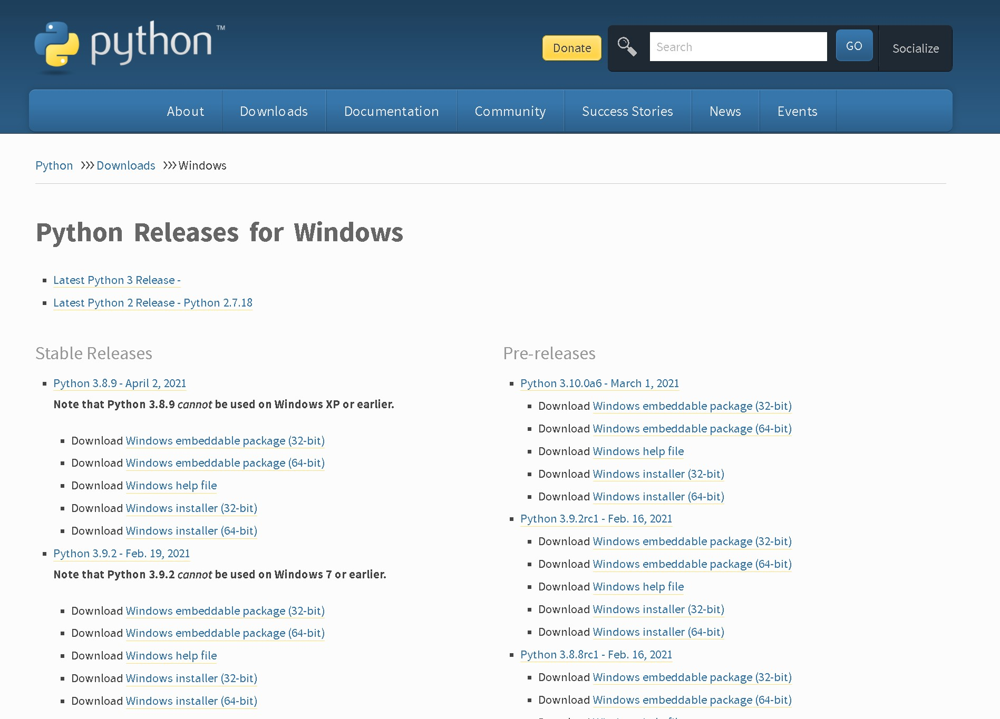
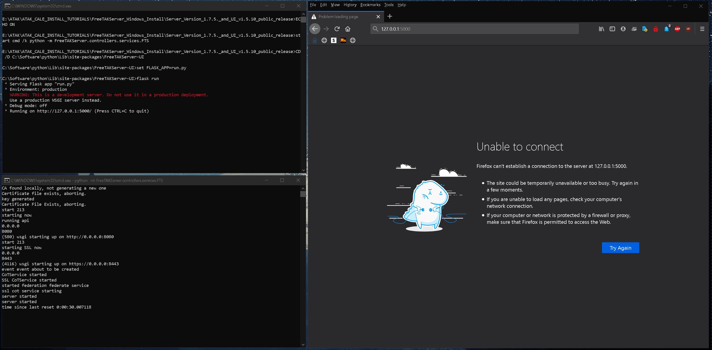

# FreeTAKServer Install On Windows Computer

Below is the installation commands and comments for the installation of FreeTAKServer `version 1.8.1` on a windows computer:

-----------

## Install Instructions (Tested on Server Version 1.8.1. and UI v1.8.1)

1. 

Install python from python.org

Download and run the installer.

```
https://www.python.org/downloads/windows/
```

Choose the installer option.

[](img/pythoninstall.jpg)

Check pip, tcl/tk and IDLE and the Python test suite.

[](img/features.jpg)

Make sure you add Python to environment variables for easy use.

[](img/advanced.jpg)

2. 

Now check that python and pip are installed and working correctly. *You should be able to open cmd anywhere and do this check*:

```
> python -V
```

should show:
> `Python 3.9.5`

```
> pip --version
```
should show:
> `C:\Users\PCName>pip --version`

> `pip 21.1.1 from J:\python\lib\site-packages\pip (python 3.9)`


[](img/chkpypip.jpg)

3. 

Once you have checked that Python and pip are working the requirements are **no longer** installed manually.

So the requirements install step can be skipped.

4. 

Install the FreeTAKServer.

```
> python -m pip install FreeTAKServer[ui]
```

5. 

After the installation has finished open the `MainConfig.py` file for editing.

The contents must be changed fo that the Windows paths can communicate with FTS.

```
MY PATH EXAMPLE
C:\Software\python\Lib\site-packages\FreeTAKServer\controllers\configuration\MainConfig.py
```

Edited contents for windows machines:

```python

import os

import yaml
currentPath = os.path.dirname(os.path.abspath(__file__))
from pathlib import Path


class MainConfig:
    """
    this is the main configuration file and is the only one which
    should need to be changed
    """


    #
    AlternateConfig = str(os.environ.get('FTS_CONFIG_PATH', 'F:\\python\\Lib\\site-packages\\FreeTAKServer\\FTSConfig.yaml'))

    #python_version = 'python3.8'

    #userpath = '/usr/local/lib/'

    if os.path.exists(AlternateConfig):
        content = open(AlternateConfig).read()
        yamlConfig = yaml.safe_load(content)

        # this is the port to which clients will connect
        CoTServicePort = int(os.environ.get('FTS_COT_PORT', yamlConfig['CoTServicePort']))

        SSLCoTServicePort = int(os.environ.get('FTS_SSLCOT_PORT', yamlConfig['SSLCoTServicePort']))

        # this needs to be changed for private data packages to work
        DataPackageServiceDefaultIP = str(os.environ.get('FTS_DP_ADDRESS', yamlConfig['DataPackageServiceDefaultIP']))

        # User Connection package IP needs to be set to the IP which is used when creating the connection in your tak device
        UserConnectionIP = str(os.environ.get('FTS_USER_ADDRESS', yamlConfig["UserConnectionIP"]))

        DBFilePath = str(os.environ.get('FTS_DB_PATH', yamlConfig["DBFilePath"]))

        # whether or not to save CoT's to the DB
        SaveCoTToDB = bool(os.environ.get('FTS_COT_TO_DB', yamlConfig["SaveCoTToDB"]))

        # api port
        APIPort = os.environ.get('FTS_API_PORT', yamlConfig["APIPort"])

        # Federation port
        FederationPort = os.environ.get('FTS_FED_PORT', yamlConfig["FederationPort"])

        # api IP
        APIIP = os.environ.get('FTS_API_ADDRESS', yamlConfig["APIIP"])

        if "MainPath" in yamlConfig.keys():
            MainPath = str(Path(yamlConfig["MainPath"]))
        else:
            MainPath = str(Path(fr'F:\\python\\Lib\\site-packages\\FreeTAKServer'))

        if "CertsPath" in yamlConfig.keys():
            certsPath = os.environ.get('FTS_CERTS_PATH', yamlConfig["CertsPath"])
        else:
            certsPath = os.environ.get('FTS_CERTS_PATH', fr'{MainPath}\\certs')

    else:
        # this is the port to which clients will connect
        CoTServicePort = int(os.environ.get('FTS_COT_PORT', 8087))

        SSLCoTServicePort = int(os.environ.get('FTS_SSLCOT_PORT', 8089))

        # this needs to be changed for private data packages to work
        DataPackageServiceDefaultIP = str(os.environ.get('FTS_DP_ADDRESS', "0.0.0.0"))

        # User Connection package IP needs to be set to the IP which is used when creating the connection in your tak device
        UserConnectionIP = str(os.environ.get('FTS_USER_ADDRESS', "0.0.0.0"))

        # api port
        APIPort = os.environ.get('FTS_API_PORT', 19023)

        # Federation port
        FederationPort = os.environ.get('FTS_FED_PORT', 9000)

        # api IP
        APIIP = os.environ.get('FTS_API_ADDRESS', '0.0.0.0')

        # whether or not to save CoT's to the DB
        SaveCoTToDB = bool(os.environ.get('FTS_COT_TO_DB', True))

        # this should be set before startup
        DBFilePath = str(os.environ.get('FTS_DB_PATH', r'F:\\python\\Lib\\site-packages\\FreeTAKServer\\FTSDataBase.db'))

        MainPath = str(Path(fr'F:\\python\\Lib\\site-packages\\FreeTAKServer'))

        certsPath = os.environ.get('FTS_CERTS_PATH', fr'{MainPath}\\certs')

    # the version information of the server (recommended to leave as default)
    version = 'FreeTAKServer-1.8.1 RC 1 Public'

    # number of milliseconds to wait between each iteration of main loop
    # decreasing will increase CPU usage and server performance
    # increasing will decrease CPU usage and server performance
    MainLoopDelay = 1/1000

    # allowed ip's to access CLI commands
    AllowedCLIIPs = ['127.0.0.1']

    # IP for CLI to access
    CLIIP = '127.0.0.1'

    ExCheckMainPath = str(Path(fr'{MainPath}\\ExCheck'))

    ExCheckFilePath = str(Path(fr'{MainPath}\\ExCheck\\template'))

    ExCheckChecklistFilePath = str(Path(fr'{MainPath}\\ExCheck\\checklist'))

    DataPackageFilePath = str(Path(fr'{MainPath}\\FreeTAKServerDataPackageFolder'))

    # format of API message header should be {Authentication: Bearer 'TOKEN'}
    from uuid import uuid4
    id = str(uuid4())

    nodeID = os.environ.get('FTS_NODE_ID', f"FreeTAKServer-{id}")

    # set to None if you don't want a message sent
    ConnectionMessage = f'Welcome to FreeTAKServer {version}. The Parrot is not dead. It’s just resting'

    certsPath = os.environ.get('FTS_CERTS_PATH', fr'{MainPath}\\certs')


    keyDir = str(Path(fr'{certsPath}\\pubserver.key'))

    pemDir = str(Path(fr'{certsPath}\\pubserver.pem'))  # or crt

    unencryptedKey = str(Path(fr'{certsPath}\\pubserver.key.unencrypted'))

    p12Dir = str(Path(fr'{certsPath}\\pubserver.p12'))

    CA = str(Path(fr'{certsPath}\\ca.pem'))
    CAkey = str(Path(fr'{certsPath}\\ca.key'))

    federationCert = str(Path(fr'{certsPath}\\pubserver.pem'))
    federationKey = str(Path(fr'{certsPath}\\pubserver.key'))
    federationKeyPassword = str(os.environ.get('FTS_FED_PASSWORD','defaultpass'))
    # location to backup client packages
    clientPackages = str(Path(fr'{MainPath}\\certs\\ClientPackages'))

    password = str(os.environ.get('FTS_PASSWORD', 'defaultpass'))

    websocketkey = os.environ.get('FTS_WEBSOCKET_KEY', "YourWebsocketKey")

```

6. 

When finished configuring `MainConfig.py` open the `config.py` file for editing

```
MY PATH EXAMPLE
C:\Software\python\Lib\site-packages\FreeTAKServer-UI\config.py
```

Edited contents for windows machines:

```python

# -*- encoding: utf-8 -*-
"""
License: MIT
Copyright (c) 2019 - present AppSeed.us
"""

import os
from   os import environ

class Config(object):

    basedir    = os.path.abspath(os.path.dirname(__file__))

    SECRET_KEY = 'key'

    # This will connect to the FTS db
    SQLALCHEMY_DATABASE_URI = 'sqlite:///' + 'F:\\python\\Lib\\site-packages\\FreeTAKServer\\FTSServer-UI.db'

    # certificates path
    certpath = "F:\\python\\Lib\\site-packages\\FreeTAKServer\\certs\\"

    # crt file path
    crtfilepath = f"{certpath}pubserver.pem"

    # key file path
    keyfilepath = f"{certpath}pubserver.key.unencrypted"

    # this IP will be used to connect with the FTS API
    IP = '10.0.0.60'

    # Port the  UI uses to communicate with the API
    PORT = '19023'

    # the public IP your server is exposing
    APPIP = '10.0.0.60'

    # webmap IP
    WEBMAPIP = "127.0.0.1"

    # webmap port
    WEBMAPPORT = 8000

    # this port will be used to listen
    APPPort = 5000

    # the webSocket  key used by the UI to communicate with FTS.
    WEBSOCKETKEY = 'YourWebsocketKey'

    # the API key used by the UI to comunicate with FTS. generate a new system user and then set it
    APIKEY = 'Bearer token'

    # For 'in memory' database, please use:
    # SQLALCHEMY_DATABASE_URI = 'sqlite:///:memory:'
            
    SQLALCHEMY_TRACK_MODIFICATIONS = False

    # THEME SUPPORT
    #  if set then url_for('static', filename='', theme='')
    #  will add the theme name to the static URL:
    #    /static/<DEFAULT_THEME>/filename
    # DEFAULT_THEME = "themes/dark"
    DEFAULT_THEME = None


class ProductionConfig(Config):
    DEBUG = False

    # Security
    SESSION_COOKIE_HTTPONLY = True
    REMEMBER_COOKIE_HTTPONLY = True
    REMEMBER_COOKIE_DURATION = 3600

    # PostgreSQL database
    SQLALCHEMY_DATABASE_URI = 'postgresql://{}:{}@{}:{}/{}'.format(
        environ.get('APPSEED_DATABASE_USER', 'appseed'),
        environ.get('APPSEED_DATABASE_PASSWORD', 'appseed'),
        environ.get('APPSEED_DATABASE_HOST', 'db'),
        environ.get('APPSEED_DATABASE_PORT', 5432),
        environ.get('APPSEED_DATABASE_NAME', 'appseed')
    )


class DebugConfig(Config):
    DEBUG = True


config_dict = {
    'Production': ProductionConfig,
    'Debug': DebugConfig
}

```

7. 

In order to run the server and the GUI two terminal windows must be opened and the commands below must be run:

```
SERVER START COMMAND
> python -m FreeTAKServer.controllers.services.FTS

UI START COMMAND
> cd C:\Software\python\Lib\site-packages\FreeTAKServer-UI
> set FLASK_APP=run.py
> flask run
```

8. 

Now your server should be running. `User = admin`, `Password = password` and `GUI link` http://localhost:5000/

[](img/FTS_windows.gif)

9. 

To uninstall do:

```

> pip uninstall FreeTAKServer
> pip uninstall FreeTAKServer-UI

```

Then in the `C:\Software\python\Lib\site-packages\FreeTAKServer\` delete the `FTSDataBase.db` file.

In the `C:\Software\python\Lib\site-packages\` path delete the `FreeTAKServer` & `FreeTAKServer-UI` folders.


## Notes

If you would like to setup a Batch file (to run the server on a double click) use the commands below:

Create a `.bat` file to run the server on double click and on startup:

`StartFreeTAKServer.bat`

```bat
::INITIATE THE SERVER
ECHO ON
start cmd /k python -m FreeTAKServer.controllers.services.FTS
::WHEN RUNNING THE SCRIPT FROM A DIFFERENT DRIVE ADD THE `/D` SWITCH TO YOUR CD COMMAND
CD /D C:\Software\python\Lib\site-packages\FreeTAKServer-UI
set FLASK_APP=run.py
::flask run
flask run --host=0.0.0.0
pause
```
Now to run at startup: Go to Run (`WINDOWS + R`) and Type `shell:startup`, and paste a copy of your `StartFreeTAKServer.bat` file there.

> To check python version `python -V`

> To quickely check your IP `ipconfig`
