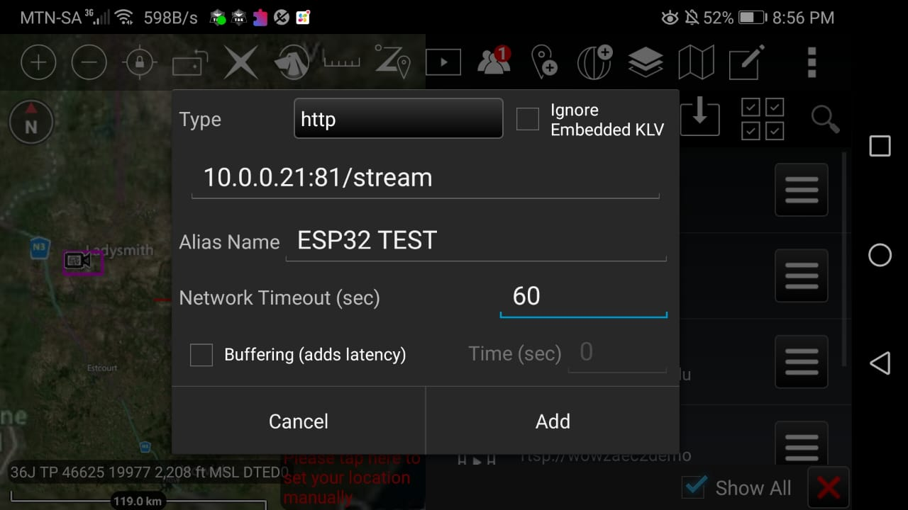

# ESP32 Cam Stream On ATAK-CIV

While exploring the video function on ATAK-CIV.

I was looking for a small inexpensive camera to mount on a board for a presentation display I decided on the ESP32-CAM board.

The board is small and cheap also once setup the board streams over wifi (locally and across the internet) only power is required.

The board works on either `3.3v` or `5v` (use 5v power to avoid brownout from current bursts).

When programming jump `IO0` and `GND`.

During my tests I noticed at least *12fps* running still on **1600x1200* but drops to *7fps* when moving around a lot...

Also note: Only 1 stream can be active at a time using this sketch.

I used the Arduino **AI Thinker ESP32-CAM CameraWebServer** sketch.

> Webpage: http://xxx.xxx.xxx.xxx/

> Stream: http://xxx.xxx.xxx.xxx:81/stream

Arduino sketch is provided in the `CameraWebServer_ATAK-CIV` folder

# Setting Up Arduino IDE

### Add the ESP32 Board Manager URL

1. Open the Arduino IDE. Make sure that you are at **version 1.8** or higher, if not then update your IDE with the latest version.
2. Click on the File menu on the top menu bar.
3. Click on the Preferences menu item. This will open a Preferences dialog box.
4. You should be on the Settings tab in the Preferences dialog box by default.
5. Look for the textbox labeled `Additional Boards Manager URLs`.
6. If there is already text in this box add a coma at the end of it, then follow the next step.
7. Paste the following link into the text box – https://raw.githubusercontent.com/espressif/arduino-esp32/gh-pages/package_esp32_index.json, if you have more then 1 link add a `, ` between each link.
8. Click the OK button to save the setting.

### Install the ESP32 Board Manager URL

1. In the Arduino IDE click on the Tools menu on the top menu bar.
2. Scroll down to the Board: entry (i.e. Board: Arduino/Genuino Uno).
3. A submenu will open when you highlight the Board: entry.
4. At the top of the submenu is Boards Manager. Click on it to open the Boards Manager dialog box.
5. In the search box in the Boards Manager enter `esp32`.
6. You should see an entry for `esp32 by Espressif Systems`. Highlight this entry and click on the Install button.
7. This will install the ESP32 boards into your Arduino IDE.

### Connect The ESP32-CAM

Connect the ESP32-CAM to your FTDI adapter and connect the FTDI adapted to your pc.

### Check Soard Settings

Once connected make sure the board settings inside the IDE are correct. Choose the board `AI Thinker ESP32-CAM`

### Select And Edit

Now select the sketch and edit the `const char* ssid = "***";` & `const char* password = "***";` fields, then verify and upload the sketch.

### Check Serial Monitor

Once the sketch has been verified remove the jumper from `IO0` & `GND` and reset the ESP32-CAM.

Check the serial monitor with a baud of `115200`.

You will see details like below:

### Open WebPage

Now use the IP given in the Serial monitor to connect th the CameraWebServer

> In my case it was: http://10.0.0.21

> The raw http stream would be: http://10.0.0.21:81/stream

When you open the webpage it will look like below: 

### Choose A Resolution

Choose your resolution. Higher will be slower and laggy... best option for ATAK-CIV was CIF at **400x296*

Also note only 1 stream can be active at a time using this sketch.

### Add Stream To ATAK-CIV

Now you can easily add the stream to ATAK-CIV (forward the correct ports when using outside your localhost network)

You can also add the stream to a sensor on the map (such as a static camera)

### Example Vid

Example video:

For more info check:

- https://dronebotworkshop.com/esp32-intro/
- https://dronebotworkshop.com/esp32-cam-intro/
- https://www.youtube.com/watch?v=visj0KE5VtY
- https://github.com/donny681/ESP32_CAMERA_QR
- https://www.espressif.com/en/support/download/all
- https://www.diyelectronics.co.za/store/iot/2317-esp32-cam-wifi-bluetooth-camera-development-board.html

