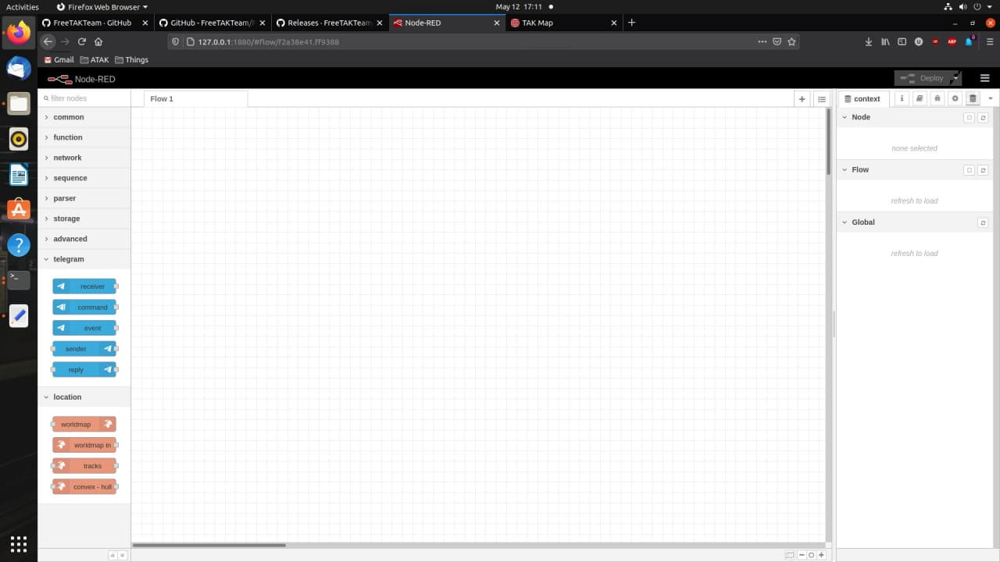
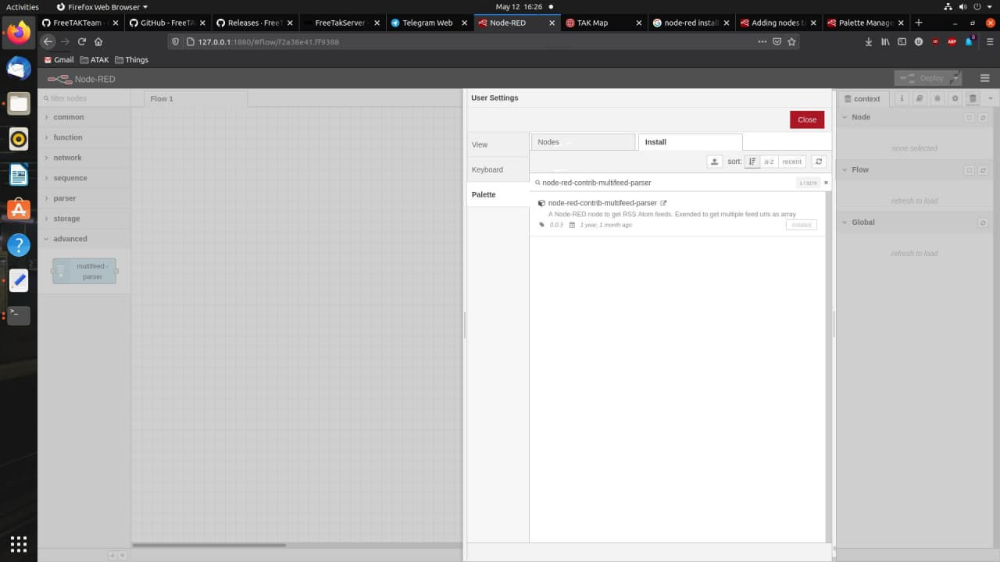
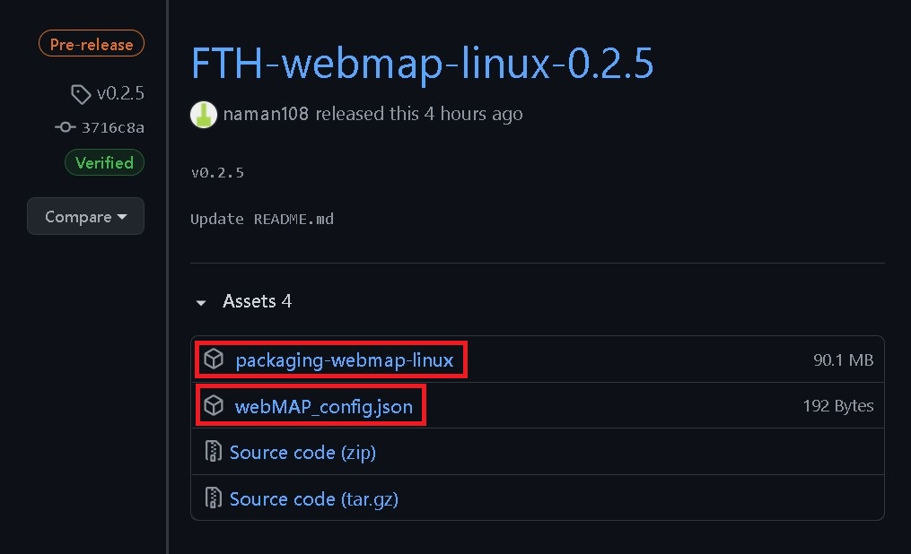
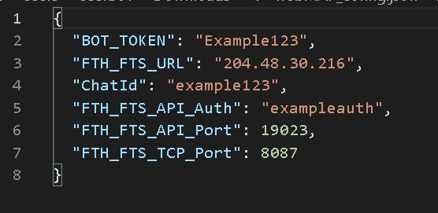
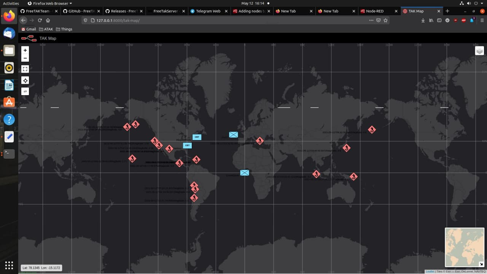

# FreeTAKHub Setup

[](img/FTHLOGO2.png)

FreeTAKHub is a component to integrate FreeTAKServer with other (non-TAK) systems. It's based on Node Red.

How to install FreeTAKHub on Ubuntu 20.04 (may work on other distros)

FreeTAKHub can be found here *https://github.com/FreeTAKTeam/FreeTAKHub*

Date Updated: as of the **`12th of May 2021`**

### 1. Update your Ubuntu distro

```
sudo apt get update
```

### 2. Install nodejs

```
sudo apt-get install nodejs
```

### 3. Install npm

```
sudo apt-get install npm
```

check node version

```
node -v
```

### 4. Install Node-Red

```
sudo npm install -g --unsafe-perm node-red node-red-admin
```

### 5. Allow Node-Red to use port 1880

```
sudo ufw allow 1880
```

### 6. Start Node-Red

```
node-red
```

[](img/node-red.jpg)

Go to  *http://127.0.0.1:1880* to see the `Node-Red` dashboard.

now under `settings > Manage Palette > install`

install the following modules

```
node-red-contrib-multifeed-parser
node-red-contrib-telegrambot
node-red-contrib-web-worldmap
```

[](img/palette.jpg)

### 7. Download FreeTAKHub

Now download the latest release of `FreeTAKHub` from *https://github.com/FreeTAKTeam/FreeTAKHub/releases*.

Download `packaging-webmap-linux` & `webMAP_config.json`.

Navigate to your download dir and make the package executable.

```
sudo chmod +x packaging-webmap-linux
```

[](img/package.jpg)

### 8. edit webMAP_config.json

Edit the JSON file `webMAP_config.json` set the "FTH_FTS_URL": "[YOUR_FTS_IP]" "FTH_FTS_TCP_Port": [YOUR_FTS_PORT]

```JSON
{
  "BOT_TOKEN": "Example123",
  "FTH_FTS_URL": "204.48.30.216",
  "ChatId": "example123",
  "FTH_FTS_API_Auth": "exampleauth",
  "FTH_FTS_API_Port": 19023,
  "FTH_FTS_TCP_Port": 8087
}
```

[](img/json.jpg)

### 9. Run the tak-map

Now run `./[package_name] /[PATHTOCONFIGURATIONFILE]/webMAP_config.json` in order to get your tak-map running.

E.G running terminal in `packaging-webmap-linux` package directory.

```
./packaging-webmap-linux /home/JONAS/Downloads/webMAP_config.json
```

Go to *http://127.0.0.1:8000/tak-map*

[](img/tak-map.jpg)

---

- Links
    - FreeTAKHub: https://github.com/FreeTAKTeam/FreeTAKHub
    - FreeTAKHub releases: https://github.com/FreeTAKTeam/FreeTAKHub/releases
    - FreeTAKTeam: https://github.com/FreeTAKTeam
    - Walk-through: https://github.com/Cale-Torino/FreeTAKServer_Docs_ETC/tree/main/6.%20FreeTAKHub%20Setup
