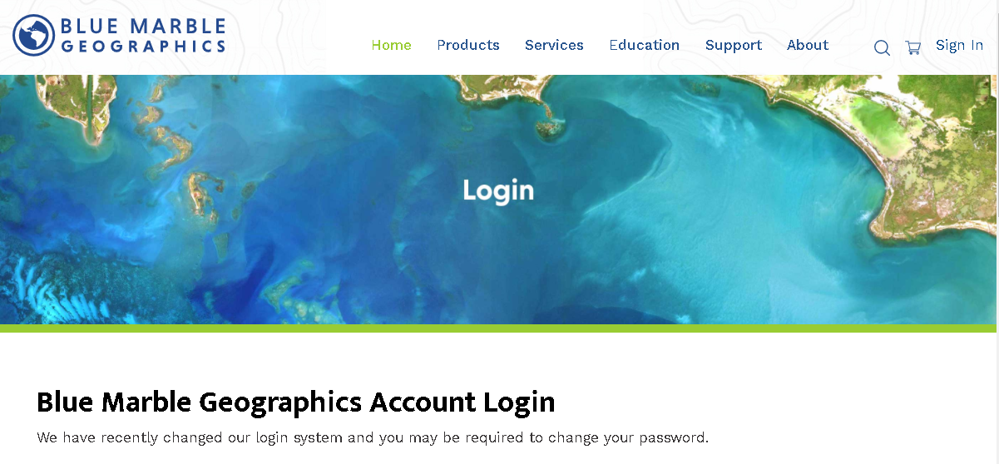
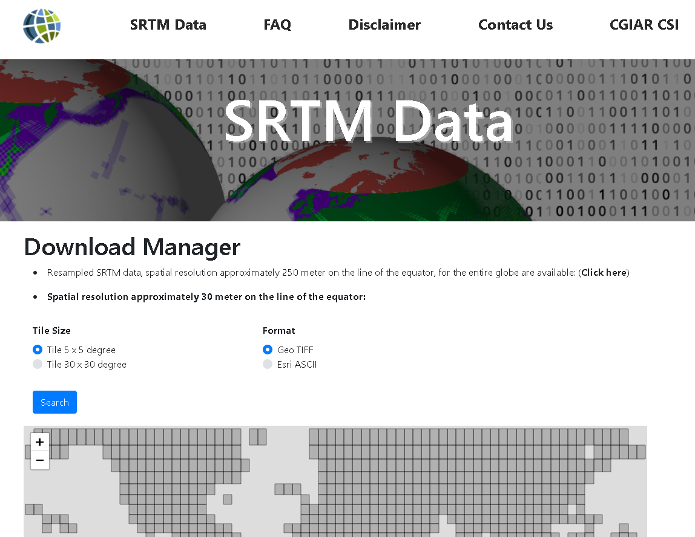

# DTED data

Make an account on the `https://www.bluemarblegeo.com/login.php` site.

Select the trial version of `Global Mapper`.

Download the `Global Mapper` desktop application for windows from `https://www.bluemarblegeo.com/global-mapper-download`

Download SRTM data from `https://srtm.csi.cgiar.org`

follow the `GM_DTED_GUIDE.pdf` to convert the SRTM data to DTED data.

---

- Links
  - link
